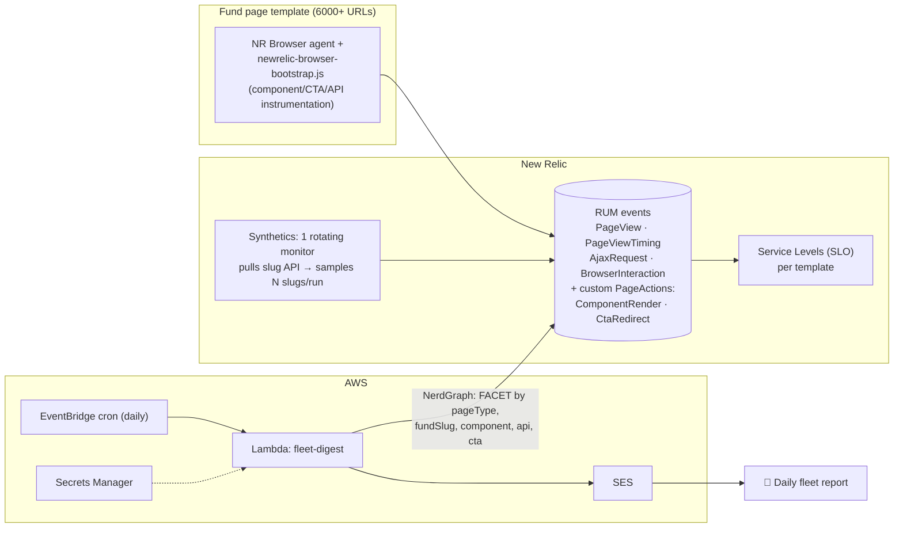

# Fleet Monitoring: 6000+ dynamic pages + component-level metrics + daily email

> Evolution of `ARCHITECTURE.md` for the real case: **one AEM/Next.js template** rendered across
> **6000+ dynamically-generated fund URLs** (slugs come from an API), where we need
> **per-component** render/latency, **CTA→redirect** time, and **API-call** timing — summarized in
> a **daily email report**.

Example page: `…/investments/nippon-india-taiwan-equity-fund-g-growth?next=true`
Components on it: Fund header + returns, NAV chart, "OPEN MF ACCOUNT" CTA, About/Key-features,
Fund-details table, **SIP "Calculate your return" calculator** (sliders + calc API), Risk & Rating gauge.

---

## 1. The two problems scale creates

**Problem A — you can't monitor 6000 URLs individually.**
6000 synthetic monitors and 6000 alert conditions are unmanageable and cost-prohibitive. The fix is
a **dimensional data model**: every event carries a `pageType` (the template) and a `fundSlug` (the
instance). You alert and report on the **template** (`pageType = 'mf-detail'`) and *drill down* by
`fundSlug` to name the worst offenders. 6000 URLs collapse into **1 monitored template + a faceted
breakdown**.

**Problem B — page-level CWV isn't enough; you want component truth.**
Default New Relic Browser gives you page LCP/INP/CLS. It does **not** tell you "did the SIP
calculator render?" or "how long did the calc API take?". That requires **custom instrumentation**
that emits one event per component render, per CTA click, and per API call — all tagged with
`pageType` + `fundSlug`.

---

## 2. Architecture (delta from v1)

Real-time incident alerting (from v1, the webhook→Lambda path) still applies — but now conditions
are **template-level** (e.g. "mf-detail render-success < 99%"), not per-URL. This doc focuses on the
**daily report** you asked for.

---

## 3. The data model (this is the crux)

Set these as **global custom attributes** on every browser event (once per page load), so *every*
PageView / AjaxRequest / PageAction is sliceable:

| Attribute | Example | Why |
|-----------|---------|-----|
| `pageType` | `mf-detail` | The template. Alert/report on this, not the URL. |
| `fundSlug` | `nippon-india-taiwan-equity-fund-g-growth` | Drill-down dimension. 6000 values, never alerted on directly. |
| `fundCategory` | `equity-sectoral` | Mid-level grouping for trends. |
| `appVersion` | `git:8f3a1c` | Attribute regressions to a release. |
| `env` | `uat` / `prod` | Separate environments. |

Then we emit **custom events** for the things New Relic doesn't capture natively:

| Event (PageAction `actionName`) | Captures | Key fields |
|---------------------------------|----------|-----------|
| `ComponentRender` | Did each component render, and how fast | `component`, `status` (`rendered`/`error`/`missing`), `renderMs`, `errorMessage` |
| `CtaRedirect` | Time from CTA click to destination ready | `cta`, `redirectMs`, `fromPath`, `toPath` |
| `AjaxRequest` *(auto)* | Every API call timing | `requestUrl`, `timeToSettle`, `httpResponseCode` |
| `BrowserInteraction` *(auto, SPA)* | In-app route/interaction settle time | `interactionName`, `duration` |

`status` matters: we report **success or failure explicitly** (via render hooks + an error
boundary) rather than inferring "didn't render" from absence — plus a post-load **manifest check**
that emits `status:'missing'` for any expected component that never fired. That's how the email can
say *"SIP calculator failed to render on 47 pages."*

Instrumentation code: `reference/instrumentation/newrelic-browser-bootstrap.js` (vanilla / AEM-friendly) and
`reference/instrumentation/newrelic-react-instrumentation.tsx` (Next.js/React).

---

## 4. Component-level metrics — how each is captured

### "Did it render, and how long?"
- **Static/markup components** (header, details table, risk gauge): tag the element with
  `data-nr-component="..."` and the [Element Timing API] attribute `elementtiming="..."`. A
  `PerformanceObserver({type:'element'})` reports `renderMs = entry.renderTime` → `ComponentRender{status:'rendered'}`.
- **Data-driven components** (NAV chart, SIP calculator — they fetch then paint): call
  `window.nrComponent('nav-chart', {status:'rendered', startMark})` the moment data is applied to the
  DOM, so `renderMs` measures *time-to-usable*, not just first paint.
- **Failures**: a React error boundary (or a try/catch around mount) reports
  `ComponentRender{status:'error', errorMessage}`.
- **Silent no-shows**: after `load` + a grace window, compare the page's declared
  `expectedComponents` manifest against those that fired; emit `status:'missing'` for the gap.

### "Time to redirect after clicking a CTA"
CTAs are tagged `data-nr-cta="open-mf-account"`. On click we stamp `Date.now()` into
`sessionStorage`; on the **destination** page load we compute
`redirectMs = (performance.timeOrigin + domContentLoadedEventEnd) − clickEpoch` and emit
`CtaRedirect`. Using epoch time bridges the two page contexts. For in-app SPA navigations we instead
use `newrelic.interaction()` so `BrowserInteraction.duration` is the click-to-settle time.

### "Time for API calls"
The New Relic Browser agent **auto-captures every fetch/XHR** as `AjaxRequest` with `timeToSettle`,
`requestUrl`, and `httpResponseCode` — so the slug-list API, the SIP-calc API, the NAV-history API
are all measured with **zero extra code**. We only normalize dynamic URLs (strip the slug) so they
group into one row per endpoint in the report.

---

## 5. Monitoring at scale — coverage strategy

1. **RUM is the primary, broad signal.** Real users hitting any of the 6000 pages populate the
   template metrics automatically. Aggregate by `pageType`; drill by `fundSlug`. This covers
   everything with real traffic, for free, all day.
2. **One rotating Synthetics monitor** covers the **long tail** (low/zero-traffic pages) and gives
   pre-user detection. A scripted monitor pulls the slug API, picks **N slugs per run** (critical
   funds always + a rotating random sample), loads each, and asserts key components exist. Over a day
   of 5-min runs it sweeps thousands of pages without 6000 monitors. It `logs` how many were checked
   so coverage is never silently capped. See `reference/synthetics/rotating-sample-monitor.js`.
3. **Service Levels (SLO)** per template (availability %, latency, render-success) give a stable
   headline number and error-budget burn for the digest.
4. **Deploy markers** via `appVersion` let the report attribute a regression to a release.

---

## 6. The daily email report (structure)

One Lambda on an EventBridge daily cron runs ~8 faceted NRQL queries and renders these sections.
Per-page rows are **aggregated + top-N worst offenders** — never 6000 rows.

1. **Fleet summary** — pages observed, total pageviews, availability %, p75 LCP/INP, JS error rate,
   Apdex, error-budget remaining. *(template-wide)*
2. **Component health** — per component: render-success %, p75 renderMs, error count, "missing" count.
   → answers *"did it render / how fast"* across the fleet.
3. **Top 10 slowest pages** — `fundSlug`, p75 load, with a New Relic drill-down link.
4. **Top render failures** — `fundSlug` × `component` × count for `status in (error, missing)`.
5. **API performance** — per endpoint (calc API, slug API, NAV API…): p95 `timeToSettle`, error %,
   call count. → answers *"how long did API calls take."*
6. **CTA performance** — per CTA: p75 `redirectMs`, click count. → answers *"time to redirect after CTA."*
7. **Synthetic coverage** — pages checked, failures, which slugs failed.
8. **Day-over-day deltas / regressions** — flag metrics worse than yesterday, tagged by `appVersion`.

Handler: `reference/lambda/fleet-digest-rum.lambda.ts`. NRQL: `reference/nrql/fleet-rum-digest.nrql`.

---

## 7. Why this scales (design rationale)

| Concern | Approach |
|---------|----------|
| 6000 URLs | Dimensional model: monitor `pageType`, facet by `fundSlug`. 1 template, not 6000 monitors. |
| Component truth | Explicit `ComponentRender` events (success/error/missing), not inferred from CWV. |
| CTA redirect time | Epoch-bridged click→destination-ready measure (cross-page) + SPA `interaction()`. |
| API time | Native `AjaxRequest` auto-capture, URLs normalized to group dynamic slugs. |
| Long-tail / zero-traffic pages | One rotating synthetic sweep over the slug API. |
| Email at scale | Aggregate + top-N; faceted NRQL; never enumerate all pages. |
| Regressions | `appVersion` attribute + day-over-day deltas. |
| Cardinality cost | Slug is an **attribute**, not a metric/monitor name → cheap to store, cheap to facet. |

---

## 8. Assumptions / things to confirm

- The front end can run **client-side JS** on the page (New Relic Browser agent + the bootstrap).
  The bootstrap is written **framework-agnostic** (data-attributes) so it works whether the page is
  React/Next-hydrated or AEM HTL-rendered. If it's React and you own the components, use the wrapper
  version for cleaner timing.
- You can add small markup hooks: `data-nr-component`, `elementtiming`, `data-nr-cta` to the template
  components (one-time template change → applies to all 6000 pages automatically).
- The slug-list API is reachable from a New Relic Synthetics location (for the rotating monitor).
- `next=true` and other query params don't change the template identity — we key on path/pageType.

[Element Timing API]: https://developer.mozilla.org/en-US/docs/Web/API/PerformanceElementTiming
