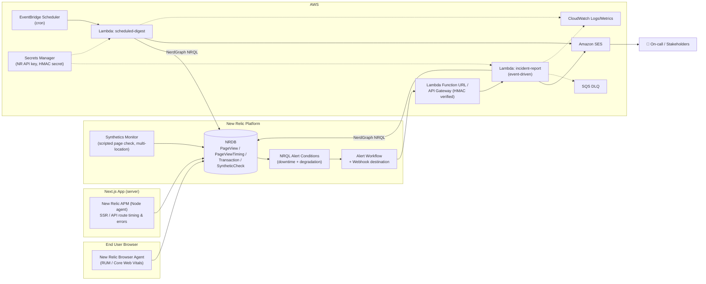
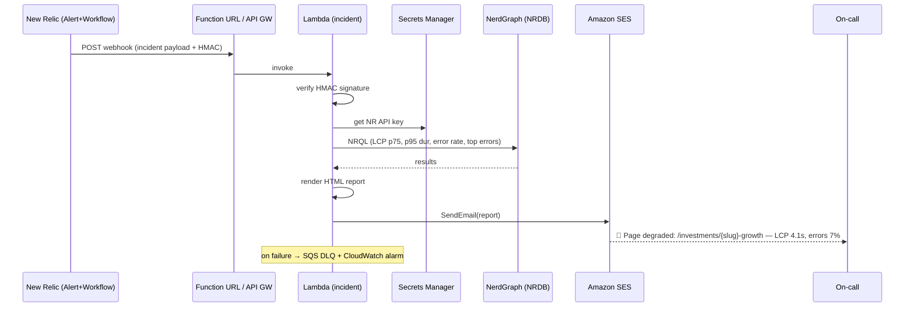

# Page Health Monitoring & Reporting Architecture

> Monitor **downtime** and **degradation** of a specific Next.js page using **New Relic**, and
> deliver an **email report** via **AWS Lambda**.

---

## 1. Goal & Scope

We want continuous, automated awareness of the health of **one critical page** (e.g.
`https://app.bajajfinserv.in/investments/nippon-india-taiwan-equity-fund-g-growth`) and an emailed report when something goes wrong (real-time)
and on a schedule (daily/weekly digest).

We track two distinct failure classes:

| Class | Definition | Primary signals |
|-------|-----------|-----------------|
| **Downtime** | Page is unreachable / returns non-2xx / fails to render | Synthetic check `result = FAILED`, HTTP status, server error rate, throughput → 0 |
| **Degradation** | Page is up but slow or partially broken | LCP / INP / CLS (Core Web Vitals), server p95 latency, Apdex drop, JS error rate, AJAX failures |

The key idea: **detect in New Relic, report with Lambda + SES.** New Relic owns measurement and
alerting; Lambda owns enrichment (pulling detailed metrics) and delivery (formatted email).

---

## 2. High-Level Architecture



### ASCII fallback

```
 Users ──► NR Browser (RUM) ─┐
 Next.js ─► NR APM (SSR)  ────┼─► NRDB ─► NRQL Alerts ─► Workflow ─► Webhook
 NR Synthetics (page ping) ──┘                                         │
                                                                       ▼
                          ┌──────────────────── AWS ───────────────────────┐
   Secrets Manager ──────►│  API GW / Function URL ─► Lambda (incident)     │
                          │  EventBridge (cron) ───► Lambda (digest)        │──► SES ──► 📧
   (NerdGraph query) ◄────┤  both query NRDB via NerdGraph for the report   │
                          │  CloudWatch logs · SQS DLQ on failure           │
                          └─────────────────────────────────────────────────┘
```

---

## 3. Monitoring Layer (New Relic)

Three complementary data sources — use all three; each covers a blind spot of the others.

### 3.1 Synthetics — the source of truth for *downtime*
A **scripted browser monitor** (or simple ping) hits the exact page URL every 1 minute from
**≥3 geographic locations**. Requiring failure from multiple locations before alerting eliminates
false positives from a single flaky checker.

- Catches downtime even when there is **zero real traffic** (nights/weekends).
- Emits `SyntheticCheck` / `SyntheticRequest` events into NRDB.
- A scripted browser monitor can also assert on **content** (e.g. "OPEN MF ACCOUNT button present"),
  catching *functional* degradation a ping would miss.

See `reference/nextjs/nextjs-newrelic-setup.md` for the monitor script.

### 3.2 Browser (RUM) — the source of truth for *user-perceived degradation*
The New Relic Browser agent embedded in the Next.js app captures **real-user** Core Web Vitals
(LCP, INP, CLS), JS errors, and AJAX timings, attributed to the page route.

- `PageView` + `PageViewTiming` events, filterable by `pageUrl` / custom `pageName`.
- Reflects real devices/networks — the metric your users actually feel.

### 3.3 APM — server-side root cause
The New Relic Node APM agent on the Next.js server measures SSR/API transaction time, throughput,
error rate and Apdex for the page's route.

- `Transaction` / `TransactionError` events.
- Lets the report answer "was it the server or the client?".

---

## 4. Detection / Alerting Layer

Define **NRQL alert conditions** (see `reference/nrql/single-page-alerts-and-report.nrql`) grouped into one
**Alert Policy** for the page, then route them through a single **Workflow** to a **Webhook
destination** (the Lambda).

Recommended conditions:

| Condition | Signal | Example threshold |
|-----------|--------|-------------------|
| Page down | `SyntheticCheck` failures across locations | ≥ 2 locations FAILED for 2 min |
| Server errors | `Transaction` error rate | > 5% for 5 min |
| Slow SSR | `Transaction` p95 duration | > 2s for 5 min |
| Slow LCP | `PageViewTiming` p75 LCP | > 2.5s for 10 min |
| Apdex drop | `Transaction` apdex | < 0.85 for 10 min |

Design notes:
- Use **p75/p95**, not averages — tail latency is what users feel and averages hide it.
- Set **evaluation windows + "at least once / for at least"** to avoid flapping.
- **Group** related conditions in one Workflow so a single incident → single email, not five.
- Add **descriptive labels** and a **runbook URL** to each condition; the Lambda forwards them.

---

## 5. Reporting / Notification Layer (AWS Lambda)

Two Lambdas, two triggers, same shared report-builder module.

### 5.1 Pipeline A — Real-time incident report (event-driven)
```
NRQL Alert ─► Workflow ─► Webhook ─► (Function URL/API GW, HMAC) ─► Lambda(incident) ─► SES
                                                                         │
                                                          NerdGraph NRQL │ (pull window metrics)
                                                                         ▼
                                                                       NRDB
```
1. New Relic fires the workflow webhook with the incident payload (id, title, priority, entity,
   open/close, timestamps).
2. Lambda **verifies the HMAC signature**, then **queries NerdGraph** with NRQL scoped to the
   incident window to enrich the alert (current LCP/p95/error rate, last 30 min sparkline data,
   top error messages, affected geos).
3. Lambda renders an **HTML email report** (summary + tables + deep links into New Relic) and
   sends it via **SES**. Failures go to an **SQS DLQ**.

Handler: `reference/lambda/incident-alert-email.lambda.ts`

### 5.2 Pipeline B — Scheduled digest (cron)
```
EventBridge Scheduler (e.g. daily 09:00) ─► Lambda(digest) ─► NerdGraph NRQL ─► SES
```
A daily/weekly digest of the page's SLA: uptime %, availability, p75 LCP trend, p95 SSR,
error rate, Apdex, worst incidents. Good for stakeholders even when nothing broke.

Handler: `reference/lambda/single-page-daily-digest.lambda.ts`

### 5.3 Why Lambda (and not "just New Relic email")?
New Relic can email raw alerts, but Lambda lets us:
- **Enrich** — join multiple NRQL results into one narrative report.
- **Format** — branded HTML / CSV / PDF attachment tuned for stakeholders.
- **Route** — different recipients by severity; integrate ticketing later.
- **Control cost/noise** — dedupe, throttle, add business context (deploy markers, feature flags).

---

## 6. Sequence — Incident Email



---

## 7. Security

- **Webhook auth:** New Relic signs/stamps a shared secret; Lambda verifies an **HMAC-SHA256**
  signature (constant-time compare) before doing any work. Reject unsigned/invalid requests.
- **Secrets:** New Relic **User API key** (NerdGraph) and the HMAC secret live in **Secrets
  Manager**, never in env vars or code. Cache them in the Lambda execution context.
- **Least privilege IAM:** Lambda role may only `ses:SendEmail`, `secretsmanager:GetSecretValue`
  (specific ARNs), `logs:*` for its log group, and `sqs:SendMessage` to its DLQ.
- **SES:** verified domain + DKIM/SPF/DMARC; production access (out of sandbox); recipients
  allow-listed via a config, not hard-coded.
- **Network:** Function URL with `AWS_IAM` auth, or API Gateway + resource policy / WAF if you
  need IP allow-listing of New Relic's egress ranges.

---

## 8. Reliability & Observability (of the pipeline itself)

- **Idempotency:** key on New Relic `issueId` + state; ignore duplicate webhook deliveries.
- **Retries + DLQ:** async invoke with max-retry → **SQS DLQ**; CloudWatch alarm on DLQ depth.
- **Self-monitoring:** CloudWatch alarms on Lambda `Errors`/`Throttles`/`Duration`; SES bounce
  & complaint metrics; **heartbeat** so a *silent* pipeline (no emails because Lambda is broken)
  is itself alarmed — "who watches the watcher".
- **NerdGraph resilience:** timeouts, exponential backoff, and a degraded-mode email that still
  fires with the raw alert payload if enrichment queries fail.

---

## 9. Cost (order of magnitude)

- **Synthetics:** billed per check; 1-min × 3 locations is the main NR cost lever — tune
  frequency/locations to budget.
- **Lambda:** a few invocations/day → effectively free tier.
- **SES:** ~$0.10 per 1,000 emails.
- **EventBridge / Secrets Manager / CloudWatch:** negligible.

Dominant cost is New Relic data ingest + synthetic checks, not the AWS side.

---

## 10. Trade-offs & Alternatives

| Decision | Chosen | Alternative | Why |
|----------|--------|-------------|-----|
| Downtime detection | Multi-location **Synthetics** | RUM-only | RUM can't see downtime when traffic is zero |
| Trigger | NR Workflow **webhook → Lambda** | NR native email | Lambda enables enrichment, formatting, routing |
| Ingress | **Function URL + HMAC** | API GW | Simpler/cheaper; switch to API GW for WAF/IP allow-list |
| Email | **SES** | SNS / SendGrid | Rich HTML + attachments, AWS-native, cheap |
| Real-time + digest | **Both** | One only | Incidents need speed; stakeholders need trends |
| Latency metric | **p75/p95** | average | Averages hide the tail users actually feel |

**Alternatives worth knowing:** New Relic can also push to **AWS EventBridge** directly (partner
event source) instead of a webhook — cleaner if you're already EventBridge-centric. For SLO-style
reporting, model the page as a **New Relic Service Level** (SLI/SLO) and report error budget burn.

---

## 11. Implementation Checklist

- [ ] Add New Relic **APM** to Next.js server (`instrumentation.ts`).
- [ ] Add New Relic **Browser** agent to the root layout.
- [ ] Create **Synthetics** scripted monitor for the page (multi-location, content assertion).
- [ ] Author **NRQL alert conditions** (downtime + degradation) in one policy.
- [ ] Create **Workflow** → **Webhook** destination pointing at the Lambda URL with HMAC.
- [ ] Store **NR API key** + **HMAC secret** in **Secrets Manager**.
- [ ] Deploy **incident** Lambda (Function URL, DLQ, IAM, SES).
- [ ] Deploy **digest** Lambda + **EventBridge** schedule.
- [ ] Verify **SES** domain (DKIM/SPF/DMARC), request production access.
- [ ] Add **CloudWatch alarms** on Lambda/DLQ/SES + a heartbeat.
- [ ] Provision all of the above with **Terraform** (`reference/terraform/main.tf`).

---

## 12. Reference Implementation Files

| File | Purpose |
|------|---------|
| `reference/nextjs/nextjs-newrelic-setup.md` | Wire APM + Browser into Next.js; synthetics script |
| `reference/nrql/single-page-alerts-and-report.nrql` | Alert conditions + report NRQL queries |
| `reference/lambda/incident-alert-email.lambda.ts` | Event-driven enrichment + SES email |
| `reference/lambda/single-page-daily-digest.lambda.ts` | Cron digest report |
| `reference/lambda/report-shared.ts` | Shared NerdGraph client + HTML renderer + SES send |
| `reference/terraform/main.tf` | IaC: NR alerts/workflow + AWS Lambda/SES/EventBridge |
