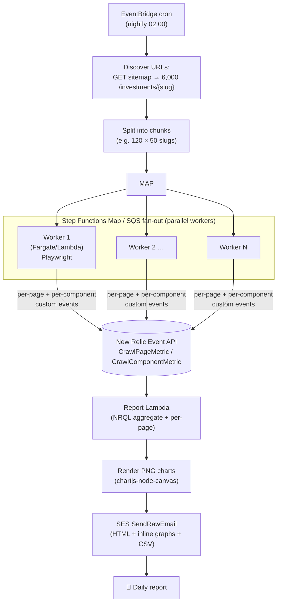
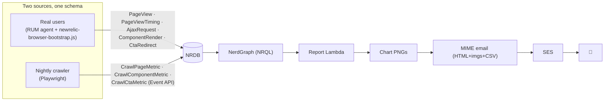

# How the data is collected: crawling 6000 pages, per-component metrics & graphs

> Answers: *"Am I getting all the average metrics for all 6000 pages? How are the pages and
> components crawled, how is every metric collected, and how are the graphs produced?"*

---

## 0. Direct answer first

There are **two ways** to get the numbers, and they cover different things. The earlier report
(`all-pages-daily-digest-realuser.lambda.ts`) uses model **A** only. For *complete per-page coverage of all 6000*,
you add model **B**.

| | **A — Passive (RUM)** | **B — Active (nightly crawler)** |
|---|---|---|
| How | Real users' browsers send telemetry | A headless browser visits every URL on a schedule |
| Coverage | Only pages that got **real traffic** (~5,842/6,000) | **All 6,000**, every night, guaranteed |
| Per-page detail | Aggregate + top-N worst only | **Full per-page row for every slug** |
| Truth it tells | What real users actually felt | A controlled, comparable baseline |
| Cost | Free (already flowing) | Compute to render 6,000 pages nightly |
| Blind spot | Zero-traffic pages | Synthetic ≠ real user/device/network mix |

**Recommendation: run both.** Crawler = completeness + comparable per-page baseline; RUM = real
user truth. The daily email merges them: aggregates + graphs from the crawl (all 6,000) **and**
real-user CWV from RUM. The rest of this doc explains model B end-to-end.

---

## 1. The crawl pipeline (all 6,000 pages, nightly)



### 1.1 Discover URLs
The crawler fetches the site's **sitemap** (`SITEMAP_URL` = `…/api/amc-pdp/sitemap-details`) — the
authoritative JSON list of ~6,000 fund URLs — and extracts the slug from each `/investments/{slug}-growth`
entry (the monitored template; non-growth URLs are skipped), then builds the full URLs
(`…/investments/{slug}?next=true`). No guessing, no stale list.

### 1.2 Fan-out (why you can't do it in one process)
Rendering 6,000 pages in a real browser sequentially takes hours. So we **shard**: split the 6,000
into ~120 chunks of 50 and run them in parallel.
- **AWS Fargate** (recommended): a few long-running tasks, each crawling many pages — no 15-min cap.
- **Lambda + Step Functions `Map`** (or SQS fan-out): each invocation crawls one chunk (~50 pages,
  well under 15 min); the state machine runs them concurrently. Simpler if you're all-Lambda.

Each worker `log`s how many pages it crawled so coverage is **never silently truncated**.

### 1.3 Per-page measurement (Playwright)
For each URL the worker opens a fresh browser context and measures everything in one visit:
load timing, Core Web Vitals, **each component (rendered? how long?)**, **each API call timing**,
**each CTA redirect time**, and JS errors. Details in §2. Code: `reference/crawler/playwright-crawl-worker.ts`.

### 1.4 Sink — push to New Relic so it's queryable like everything else
Each worker posts results to the **New Relic Event API** as custom events
(`CrawlPageMetric`, one per page; `CrawlComponentMetric`, one per component-per-page). Now the crawl
data lives in NRDB next to RUM/Synthetics and the report queries it with the *same* NRQL/NerdGraph
path — no separate datastore. (Alternative sink: S3/DynamoDB if you prefer to keep raw data outside
New Relic; the report Lambda would read from there instead.)

---

## 2. How each metric is actually measured (the mechanics)

The crawler measures the same schema the live-page instrumentation emits, so RUM and crawl line up.

### 2.1 "Did the component render, and how long did it take?"
For every component selector (e.g. `[data-nr-component="sip-calculator"]`):
1. **Rendered?** — `locator.isVisible()` after the page settles. Visible → `rendered`; absent/hidden
   → `missing`; threw/console-error tied to it → `error`.
2. **How long?** — read the **Element Timing API** entry
   (`performance.getEntriesByName('sip-calculator', 'element')[0].renderTime`) for markup components,
   or a `performance.measure()` mark the component emits when its data is applied (true
   time-to-usable for the chart/calculator). Emitted as `CrawlComponentMetric{component, status, renderMs}`.

### 2.2 "How long did API calls take?"
Playwright sees the network. We hook `page.on('requestfinished')` and read
`request.timing()` (`responseEnd − requestStart`) plus the response status, per request. Dynamic
URLs are normalized to their path (slug stripped) so they group: `/api/funds/sip-calculate`,
`/api/funds/nav-history`, etc. Emitted per endpoint with `durationMs` + `status`.

### 2.3 "Time to redirect after clicking a CTA"
The worker locates each `[data-nr-cta]`, records `t0 = Date.now()`, clicks, waits for
`page.waitForURL()` / navigation + `domcontentloaded`, then `redirectMs = Date.now() − t0`. Done in
an isolated context so it doesn't pollute the load measurement. Emitted as `CrawlCtaMetric{cta, redirectMs}`.

### 2.4 Page load + Core Web Vitals
From the Navigation Timing API (`domContentLoadedEventEnd`, `loadEventEnd`) and the `web-vitals`
library injected into the page (LCP/INP/CLS). Emitted on `CrawlPageMetric`.

### 2.5 JS errors / functional breakage
`page.on('pageerror')` and `page.on('console', msg => msg.type()==='error')` are collected and
counted per page → `CrawlPageMetric.jsErrors` (and surfaced as render `error` for the owning component).

---

## 3. End-to-end data flow



The report Lambda runs **two query families**:
- `FROM CrawlPageMetric / CrawlComponentMetric` → **complete, all-6,000** aggregates + per-page CSV.
- `FROM PageView / PageViewTiming` → **real-user** CWV to sit alongside the crawl baseline.

---

## 4. How the report is computed (where the "averages for 6000" come from)

Because every crawled page emits one `CrawlPageMetric`, you get genuine all-6,000 aggregates and a
full per-page breakdown:

```sql
-- Fleet average/percentiles across ALL 6,000 crawled pages
SELECT count(*) AS pages, average(loadMs) AS avg_load, percentile(loadMs,75) AS p75,
       average(jsErrors) AS avg_js_errors
FROM CrawlPageMetric WHERE pageType='mf-detail' SINCE 1 day ago;

-- Component render success + latency across ALL pages
SELECT percentage(count(*), WHERE status='rendered') AS ok, percentile(renderMs,75) AS p75,
       filter(count(*), WHERE status='error') AS errors, filter(count(*), WHERE status='missing') AS missing
FROM CrawlComponentMetric WHERE pageType='mf-detail' FACET component SINCE 1 day ago;

-- FULL per-page table (all 6,000 rows) → exported to the CSV attachment
SELECT average(loadMs), max(lcp), sum(jsErrors)
FROM CrawlPageMetric WHERE pageType='mf-detail' FACET fundSlug SINCE 1 day ago LIMIT MAX;
```

The email body still shows **aggregates + graphs + top-N** (6,000 rows in an email is unreadable);
the **complete per-page matrix ships as a CSV attachment**.

> **Scale caveat:** `FACET fundSlug LIMIT MAX` is capped at NerdGraph's facet limit (~10k) — fine for
> ~6,000 pages, but it **silently keeps only the top facets** beyond that. The report guards this by
> comparing the per-page row count to `uniqueCount(fundSlug)` and flagging truncation in the coverage
> banner; past the cap, export the per-page set from the crawler's **S3 output** instead of re-querying
> NRDB. And SES caps a raw email at **10 MB**, so a very large CSV should be **linked from S3**, not attached.

---

## 5. The graphs — how they're generated and put in the email

**Key constraint:** email clients don't run JavaScript and usually block remote images. So charts
must be **static images embedded inline** (not Chart.js in the email, not a live dashboard iframe).

Pipeline (in the report Lambda):
1. Pull the series with NRQL `TIMESERIES` / `FACET` (e.g. p75 load over 7 days; per-component render
   success; top-10 slowest pages bar; API p95 bars).
2. Render each to a **PNG** server-side with **`chartjs-node-canvas`** (Chart.js on a Node canvas) →
   `Buffer`.
3. Build a **multipart/related MIME** message: HTML body references each image by `cid:` and the PNGs
   ride along as inline attachments. Send with **SES `SendRawEmail`** (the plain `SendEmail` used by
   the v1 report can't carry inline images).
4. Attach the per-page **CSV** as a normal attachment in the same MIME message.

Code: `reference/lambda/rich-email-builder.ts` (chart rendering + MIME builder + SendRawEmail).

Graphs included in the daily email:
- **7-day trend** — fleet p75 load & LCP (line) → spot regressions over time.
- **Component render success** (bar, per component) → which component is breaking.
- **Component render latency p75** (bar) → which component is slow.
- **API p95** (bar, per endpoint) → which API is the bottleneck.
- **Top-10 slowest pages** (horizontal bar) → worst slugs at a glance.
- **CTA redirect p75** (bar) → which CTA is laggy.

Alternatives (with trade-offs): **QuickChart.io** (`` to a chart-image service — simplest,
but remote-image blocking hurts deliverability) or **inline SVG** (renders in Apple Mail, not
Gmail/Outlook — unreliable). Server-rendered PNG + `cid` is the robust default.

---

## 6. What you actually receive each morning

1. **HTML email** — fleet aggregates (all 6,000, from the crawl) + real-user CWV (RUM) + the graphs
   above + top-N worst-offender tables (the layout you previewed, now with charts on top).
2. **`fleet-YYYY-MM-DD.csv`** — one row per slug for all 6,000: load, LCP, per-component
   rendered/renderMs, API timings, CTA redirect, JS errors. This is your "all 6,000 averages" view.
3. Deep links into New Relic for any row.

---

## 7. Cost & runtime for 6,000 pages (rough)

- **Compute:** ~6,000 page renders nightly. With 20 parallel workers at ~3s/page ≈ **15 min** total.
  Fargate spot for a nightly 15–30 min job is cents/day; Lambda fan-out similar.
- **New Relic ingest:** ~6,000 `CrawlPageMetric` + ~36,000 `CrawlComponentMetric` events/night — tiny
  vs RUM volume.
- **SES:** a handful of emails/day — negligible.
- **Tuning levers:** crawl frequency (nightly vs hourly for a critical subset), worker parallelism,
  whether to click CTAs on every page or a sample.

---

## 8. Recommended setup (hybrid)

| Need | Use |
|------|-----|
| Complete per-page baseline for all 6,000 | **Nightly crawler** → `CrawlPageMetric` |
| Real-user experience (devices/networks/geos) | **RUM** → `PageView` / `PageViewTiming` |
| Real-time downtime/degradation alerts | **Synthetics** + NRQL alert → webhook Lambda (v1) |
| Daily digest with graphs + per-page CSV | **Report Lambda** merging crawl + RUM, charts via PNG |

---

## 9. Reference files for this process

| File | Purpose |
|------|---------|
| `reference/crawler/playwright-crawl-worker.ts` | Playwright worker: crawl a chunk, measure components/APIs/CTAs, push NR events |
| `reference/crawler/crawl-fanout-orchestration.md` | Fan-out options (Step Functions Map / SQS / Fargate) + scheduling |
| `reference/lambda/rich-email-builder.ts` | Render PNG charts + build MIME + SES SendRawEmail (graphs in the mail) |
| `reference/nrql/all-pages-crawl-digest.nrql` | Aggregate + full per-page NRQL over the crawl events |
