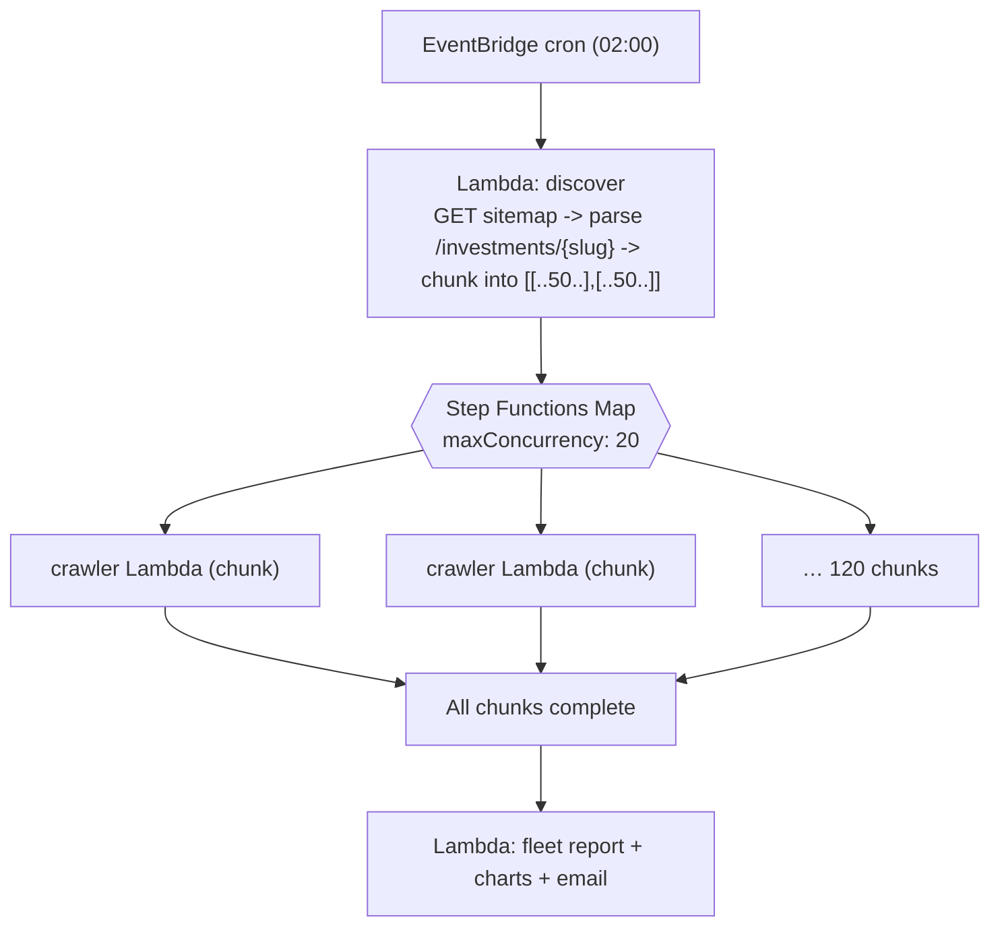
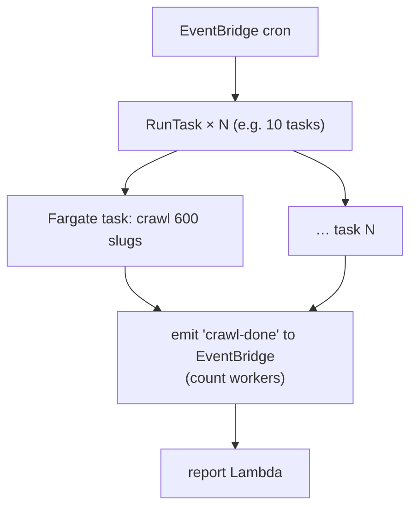
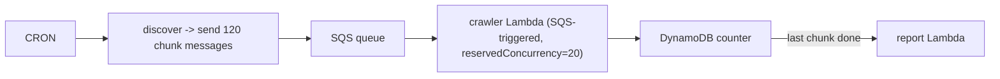

# Crawler orchestration — fanning 6,000 pages across parallel workers

The `playwright-crawl-worker.ts` worker crawls a **chunk** of slugs. Something must discover all 6,000 slugs
(from the site's **sitemap**, `SITEMAP_URL`), split them, run the workers in parallel, then trigger the
report. Three options.

---

## Option A — Step Functions `Map` + Lambda (all-serverless, recommended to start)



- **discover** Lambda: fetch the **sitemap** (`SITEMAP_URL`, ~6,000 URLs), extract the slug from each
  `/investments/{slug}-growth` entry (the monitored template — skip any non-growth URL), dedupe →
  return `{ chunks: [{slugs:[...50]}, …] }` (≈120 chunks for 6,000), matching the Map's
  `ItemsPath: "$.chunks"` below.
- **Map state**: `MaxConcurrency: 20` runs 20 crawler Lambdas at a time; the rest queue. Each crawls
  ~50 pages in well under the 15-min Lambda limit.
- On completion the state machine invokes the **report** Lambda.
- Chromium on Lambda: package `@sparticuz/chromium` + `playwright-core` (or a container image).

State machine sketch:
```json
{
  "StartAt": "Discover",
  "States": {
    "Discover": { "Type": "Task", "Resource": "<discover-fn-arn>", "Next": "CrawlAll" },
    "CrawlAll": {
      "Type": "Map", "MaxConcurrency": 20, "ItemsPath": "$.chunks",
      "ItemProcessor": {
        "ProcessorConfig": { "Mode": "DISTRIBUTED" },
        "StartAt": "Crawl",
        "States": { "Crawl": { "Type": "Task", "Resource": "<crawler-fn-arn>", "End": true } }
      },
      "Next": "Report"
    },
    "Report": { "Type": "Task", "Resource": "<report-fn-arn>", "End": true }
  }
}
```

**Pros:** no servers, built-in concurrency/retry/visibility. **Cons:** Lambda cold starts + chromium
packaging; 15-min cap per chunk (fine at 50 pages/chunk).

---

## Option B — Fargate tasks (best for the full 6,000 at scale)



- Each task is a long-running container (no 15-min cap) that pulls its slice (by index env var) and
  crawls hundreds of pages with internal concurrency (e.g. 5 browser contexts).
- Use **Fargate Spot** for the nightly batch → cents/run.
- Coordinate completion via a counter in DynamoDB or an EventBridge "all done" rule → report Lambda.

**Pros:** no time cap, cheaper for big batches, full Playwright. **Cons:** you manage the task
definition / image.

---

## Option C — SQS fan-out (decoupled, self-throttling)



- Reserved concurrency on the consumer caps parallelism naturally; failed chunks retry via the queue;
  a DLQ catches poison messages.
- The report fires when the completion counter hits the chunk total.

---

## Scheduling & tuning

- **Cadence:** nightly full crawl (all 6,000) + optionally an **hourly** crawl of a *critical subset*
  (top-traffic funds) for faster detection.
- **Chunk size:** 50/chunk on Lambda, 300–600/task on Fargate.
- **Parallelism:** start at 20 concurrent; raise until the origin/CDN tolerates it (you're hitting UAT
  — coordinate so the crawl doesn't look like an attack).
- **Politeness:** small per-request delay, a recognizable `User-Agent` (e.g. `nr-playwright-crawl-worker`), and
  allow-list the crawler's egress IPs with the platform team.
- **Idempotency / coverage proof:** each worker logs `crawled N of M`; the report asserts
  `pages_crawled ≈ 6,000` and flags the gap if not — coverage is never silently truncated.
- **Auth:** if pages need login, inject a session cookie/token into the Playwright context.
